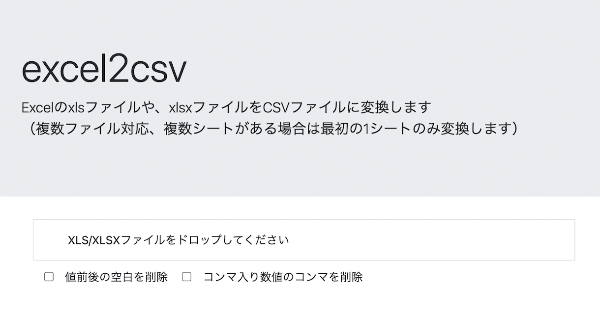

# excel2csv
 


https://code4fukui.github.io/excel2csv/

## for developer

install [Deno](https://deno.land/)

```js
import { excel2csv } from "https://code4fukui.github.io/excel2csv/excel2csv.csv";
await excel2csv("sample.xls", "out.csv");
```
